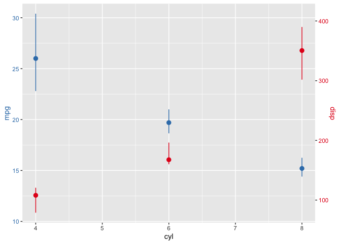

<!-- README.md is generated from README.Rmd. Please edit that file -->

# miscRpackage

<!-- badges: start -->
<!-- badges: end -->

The goal of miscRpackage is to save miscellaneous function that I find
useful

## Installation

You can install the development version of miscRpackage from
[GitHub](https://github.com/) with:

``` r
# install.packages("devtools")
devtools::install_github("thehung92/miscRpackage")
```

## Example

This is a basic example which shows you how to solve a common problem:

``` r
library(miscRpackage)
## basic example code
ggplot_dual_yaxis(mtcars, "cyl", "mpg", "disp")
```


